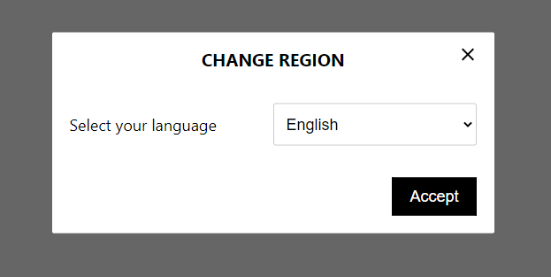

### Vsge Language Switcher:

Language Switcher (vls) is a lightweight gutenberg block module designed to facilitate language and region selection on your website. It provides a user-friendly modal window for users to choose their preferred language and region, seamlessly redirecting them to the selected content.



# Features:

- Modal Window: A sleek and responsive modal window interface for language and region selection.
- Cookie Management: Efficient handling of language and region preferences through browser cookies.
- Dynamic Language List: Generates a dynamic language list menu based on provided datasets.
- Region-based Element Visibility: Displays or hide an element based on the user's region.

---

## How to Change the Default Region List

To update the regions displayed in the language switcher, you must define a new list of regions in the `wp-config.php` file. The regions are defined as an associative array, where the keys represent the regions, and the values represent either the region name or a nested array of countries within the region.

### Example Configuration

In your `wp-config.php` file, add the following code to define the regions:

```php
define( 'VLS_REGIONS', array(
    'europe' => array(
        'europe' => 'Europe',
        'gb' => 'United Kingdom',
        'fr' => 'France',
        'de' => 'Germany',
    ),
    'middle_east_africa' => 'Middle East / Africa',
    'asia_pacific' => 'Asia / Pacific',
    'americas' => 'Americas',
) );
```

### Explanation

- The outer array represents the continents or main regions.
- The inner arrays (if present) represent countries within those regions.
- If a region is defined as a string (e.g., `middle_east_africa`), it will be treated as a single option without sub-regions.

### Empty Value Configuration

Passing an empty value for the regions will result in a language-only selector.

---

## Editor's Guide to Region-based Element Visibility

This guide is intended for content editors to help you manage the visibility of elements on a webpage based on different regions. By using specific CSS classes, you can control which elements are shown or hidden depending on the user's region.

### Available Regions and CSS Classes

Here are the regions you can target and the corresponding CSS classes you can use:

1. **Europe**
    - `show-in--europe-europe`
    - `show-in--europe-gb`
    - `show-in--europe-de`
2. **Middle East & Africa**
    - `show-in--middle_east_africa`
3. **Asia Pacific**
    - `show-in--asia_pacific`
4. **Americas**
    - `show-in--americas`

### How to Use CSS Classes

To show or hide elements based on the user's region, add the appropriate CSS class to the HTML elements. Only elements with the class matching the current region will be visible. All other elements will be hidden automatically.

#### Examples

1. **Showing Content for Europe**

   ```html
   <div class="show-in--europe-europe">
       This content is visible only in Europe.
   </div>
   <div class="show-in--europe-gb">
       This content is visible only in Great Britain.
   </div>
   <div class="show-in--europe-de">
       This content is visible only in Germany.
   </div>
   ```

2. **Showing Content for Middle East & Africa**

   ```html
   <div class="show-in--middle_east_africa">
       This content is visible only in the Middle East & Africa.
   </div>
   ```

3. **Showing Content for Asia Pacific**

   ```html
   <div class="show-in--asia_pacific">
       This content is visible only in the Asia Pacific region.
   </div>
   ```

4. **Showing Content for Americas**

   ```html
   <div class="show-in--americas">
       This content is visible only in the Americas.
   </div>
   ```

5. **Showing Content for Multiple Regions**

   ```html
   <div class="show-in--americas show-in--asia_pacific">
       This content is visible in the Americas and Asia Pacific.
   </div>
   ```

## What Happens If the Class Doesn't Match the Current Region

If an element's CSS class does not match the current region, the element will be hidden. This ensures that only the content relevant to the user's region is displayed.

### Example

Assume the current region is set to `europe`. The following elements will be shown or hidden accordingly:

```html
<!-- Shown because it matches the current region -->
<div class="show-in--europe-europe">
    This content is visible only in Europe.
</div>

<!-- Hidden because it does not match the current region -->
<div class="show-in--middle_east_africa">
    This content is hidden in Europe.
</div>
```

## Summary

- **Europe**: Use `show-in--europe-europe`, `show-in--europe-gb`, or `show-in--europe-de`.
- **Middle East & Africa**: Use `show-in--middle_east_africa`.
- **Asia Pacific**: Use `show-in--asia_pacific`.
- **Americas**: Use `show-in--americas`.

By applying these classes, you can control the visibility of elements on your webpage based on the user's region, ensuring that content is relevant and localized.

--- 

**Contact Form 7 localization:**
In addition, this plugin adds a ‘region’ field to contact forms 7 modules.

**Contributing:**
Feel free to contribute to the development of Language Switcher. Fork the repository, make your changes, and submit a pull request.

**License:**
This project is licensed under the MIT License.
